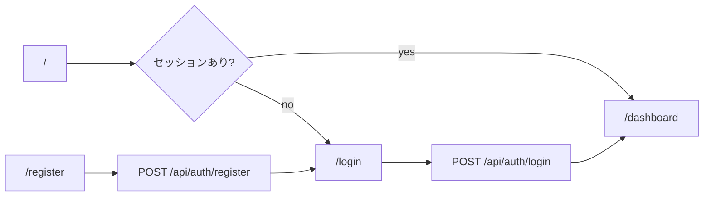

# 機能仕様書（画面・遷移・API）

本書は **Chapee** の画面一覧、主要な画面遷移、およびバックエンド API エンドポイントの一覧です。第三者が手順に沿って操作・連携を把握するための資料です。

---

## 1. 画面一覧

認証が必要な画面は `(main)` レイアウト配下です。未ログイン時は `/login` へリダイレクトされます（`src/middleware.ts`）。

| # | URL | 画面名 | 概要 |
|---|-----|--------|------|
| 1 | `/` | トップ | セッション有無で `/dashboard` または `/login` へリダイレクト。Shopee OAuth 戻りクエリを引き継ぐ |
| 2 | `/login` | ログイン | メール・パスワードでログイン |
| 3 | `/register` | ユーザー登録 | 新規アカウント作成後、ログインへ誘導 |
| 4 | `/dashboard` | ダッシュボード | 会話サマリ・同期・検索。Shopee 会話のバックグラウンド同期 |
| 5 | `/chats` | チャット一覧 | 国・対応ステータス・検索・未読フィルタ。`最新メッセージを取得` / `Shopeeと同期` |
| 6 | `/chats/[id]` | チャット詳細 | メッセージ表示・送信・翻訳・テンプレ・スタンプ・添付・問い合わせ商品バナー・対応ステータス変更 |
| 7 | `/templates` | テンプレート管理 | 返信テンプレートの一覧・編集・削除 |
| 8 | `/auto-reply` | 自動返信設定 | 国別の自動返信（時間・テンプレート） |
| 9 | `/staff` | 担当者管理 | 担当者マスタ（UI 上の割当は将来拡張想定） |
| 10 | `/settings` | 設定 | Shopee 連携・翻訳・各種設定 |

---

## 2. 画面遷移（主要フロー）

### 2.1 認証フロー



### 2.2 ログイン後のグローバルナビ（サイドバー）

同一レイアウト内で以下へ遷移します（`src/components/AppLayout.tsx` の `navItems`）。

```
/dashboard  ─┐
/chats      ─┼─  （サイドバー）
/templates  ─┤
/auto-reply ─┤
/staff      ─┤
/settings   ─┘
```

### 2.3 チャット一覧 → 詳細

```
/chats  →  行クリック  →  /chats/[conversation_id]
```

`[id]` は Shopee の `conversation_id`（文字列）です。

### 2.4 Shopee OAuth（設定から接続）

```
/settings  →  連携開始  →  GET /api/shopee/auth-url
  →  Shopee 認可画面  →  GET /api/shopee/callback  →  /dashboard?shopee_connected=…
```

---

## 3. API エンドポイント一覧

ベース URL は本番ドメイン（例: `https://example.com`）。**ブラウザから呼ぶ API** は同一オリジンで Cookie 認証が前提です。**Cron / Webhook** は別途認証または Shopee 署名です。

### 3.1 認証

| メソッド | パス | 説明 |
|----------|------|------|
| `POST` | `/api/auth/login` | ログイン。JWT を Cookie `auth-token` に設定 |
| `POST` | `/api/auth/logout` | ログアウト・Cookie 削除 |
| `POST` | `/api/auth/register` | 新規登録 |

### 3.2 チャット・会話

| メソッド | パス | 説明 |
|----------|------|------|
| `GET` | `/api/chats` | 会話一覧（MongoDB）。`country`, `handling`, `exclude_chat_types`, `unread_only`, `limit` 等のクエリ |
| `PATCH` | `/api/chats/[id]` | 会話の `handling_status` 更新 |
| `GET` | `/api/chats/[id]/messages` | メッセージ一覧（Shopee API + 必要に応じ DB キャッシュ）。問い合わせ商品の付加情報を含む |
| `POST` | `/api/chats/[id]/send` | テキスト・スタンプ送信 |
| `GET` | `/api/chats/[id]/orders` | 会話に紐づく注文情報の取得（実装に依存） |

### 3.3 テンプレート・翻訳・設定

| メソッド | パス | 説明 |
|----------|------|------|
| `GET` | `/api/reply-templates` | 返信テンプレート一覧（初回はシード） |
| `PATCH` | `/api/reply-templates` | テンプレ本文更新 |
| `DELETE` | `/api/reply-templates?id=` | テンプレ削除 |
| `POST` | `/api/translate` | メッセージ翻訳（DeepL / Google・設定に従う） |
| `GET` | `/api/settings/auto-reply` | 自動返信設定取得 |
| `PUT` | `/api/settings/auto-reply` | 自動返信設定保存 |
| `GET` | `/api/settings/translation` | 翻訳設定・API キー状況（マスク） |
| `PUT` | `/api/settings/translation` | 翻訳設定保存 |

### 3.4 Shopee 連携

| メソッド | パス | 説明 |
|----------|------|------|
| `GET` | `/api/shopee/auth-url` | OAuth 用 Shopee 認可 URL |
| `GET` | `/api/shopee/callback` | OAuth コールバック（トークン保存・リダイレクト） |
| `POST` | `/api/shopee/connect` | コード交換等の接続処理（実装参照） |
| `GET` | `/api/shopee/status` | 連携状態 |
| `GET` / `POST` | `/api/shopee/sync` | 会話同期（全店舗または `shop_id`）。POST は GET と同等 |
| `GET` | `/api/shopee/refresh-tokens` | 期限が近いトークンを一括更新。**Cron 用。** `Authorization: Bearer ${CRON_SECRET}` 推奨 |
| `POST` | `/api/shopee/webhook` | Shopee プッシュ通知。チャットは通常 code `10` |
| `GET` | `/api/shopee/webhook` | Shopee の challenge 検証用（`?challenge=`） |
| `GET` | `/api/shopee/shop-notifications` | Seller Center 通知（ヘッダー等） |
| `GET` | `/api/shopee/debug` | 開発・デバッグ用（本番では無効化推奨） |

### 3.5 担当者・Cron・管理

| メソッド | パス | 説明 |
|----------|------|------|
| `GET` | `/api/staff` | 担当者一覧 |
| `POST` | `/api/staff` | 担当者登録 |
| `DELETE` | `/api/staff` | 担当者削除 |
| `GET` | `/api/cron/auto-reply` | 期限到来の自動返信送信。**Cron 用。** `Authorization: Bearer ${CRON_SECRET}` |
| `POST` | `/api/admin/migrate-handling-status` | `handling_status` 一括補完（移行用）。**`CRON_SECRET` 必須** |

---

## 4. ミドルウェア（認証保護）

`src/middleware.ts` により、以下のパスは **ログイン必須**（`auth-token` Cookie の JWT 検証）:

- `/`, `/dashboard`, `/chats`, `/chats/*`, `/templates`, `/auto-reply`, `/staff`, `/settings`

`/login`, `/register` は未ログイン向け。`/api/*` は別ロジック（API 側でセッション不要なものあり）。

---

## 5. 外部サービスとの対応（参照）

| 機能 | 外部サービス |
|------|----------------|
| 店舗・チャット・商品 | Shopee Open Platform |
| データ永続化 | MongoDB |
| 翻訳 | DeepL / Google Cloud Translation（設定により切替） |

---

## 6. 改訂

アプリの変更に合わせて本書を更新してください。`vercel.json` の Cron や `app/api` の追加・削除時は **3 章** を必ず見直してください。
